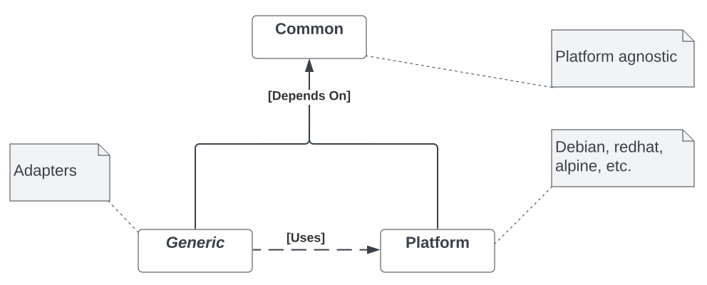

# Development Container Library
This library defines capabilities that are useful during the construction of docker images or when running pipelines within them.

## Structure and Capablities
The library supports two (2) main use-cases:

1. to provide a set of ***common*** platform-agnostic functionality (OS neutral)
2. to define OS-specific ***platform dependent*** utilities.

Both these capablities can be used when [building](https://docs.docker.com/engine/reference/commandline) Docker images from Docker files or when [running](https://docs.docker.com/engine/reference/run/) within such containers(i.e., during execution of Local CI/CD pipelines). In addition, the library provides a set of ***generics*** that can be utilized without regard to execution context providing a re-usablity mechanism.
 
 The  UML diagram presents the structure of the library: 

  

## Availablity
The library will be made available within the library folder under .devcontainer directory by the Development Container provisioning API.